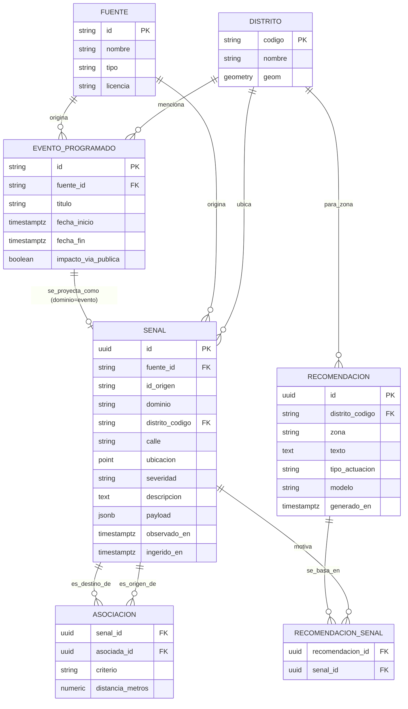
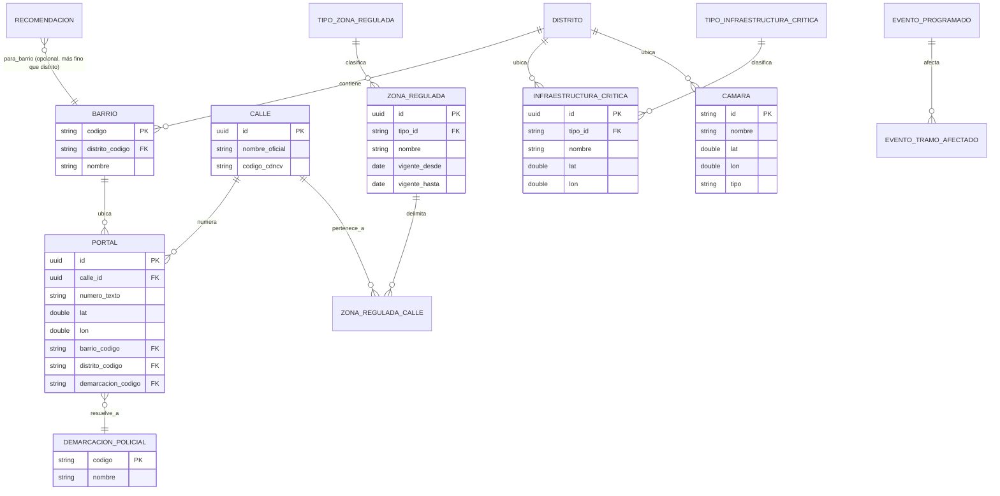
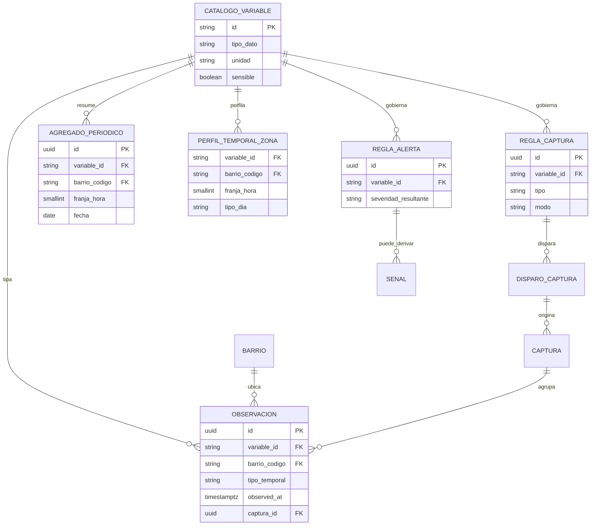

# Mirall — Modelo de datos de dominio

**Fecha:** 2026-09-17
**Estado:** Propuesta — architecture gate pedido explícitamente por el usuario antes de
implementar la escritura histórica de `047` (`ADR-006`, Postgres serverless). Este
documento se revisa y se acuerda **antes** de escribir ninguna migración SQL real contra
la base de datos.

**Misión de Mirall** (declarada por el usuario, 2026-09-17): *"Mirall transforma
información pública dispersa en una representación coherente de la ciudad que permite
comprender qué está ocurriendo y tomar decisiones."* Todo lo que sigue se mide contra esa
frase: si una entidad o relación no ayuda a "comprender qué está ocurriendo" o a "tomar
decisiones", no pertenece a este modelo sin más justificación.

**Método seguido**: el modelo de las secciones 1-7 se construyó **desde el dominio**, sin
mirar el código ni las tablas actuales — a propósito, para no arrastrar inconsistencias ya
detectadas (ver `[[spec-046-draft-047-implementado]]`: severidad mal calibrada, ids
duplicados, arrays en vez de relaciones). La comparación con lo que existe hoy en código
llega después, en la §8, precisamente para poder señalar esas discrepancias en vez de
blanquearlas.

---

## 1. Entidades fundamentales

### 1.1 `Distrito` (con `Barrio` dentro)

La unidad espacial de referencia de toda la ciudad. Cambia poquísimo (solo si el
Ayuntamiento reorganiza distritos/barrios).

- **Qué es**: una zona administrativa con nombre, código oficial y geometría.
- **Por qué existe**: es el nivel al que Mirall agrega casi todo — clima, tráfico,
  recomendaciones — porque es la unidad que un humano reconoce ("Extramurs", "Poblats
  Marítims"), no un punto lat/lon suelto.
- **Naturaleza**: catálogo/dimensión — de referencia, no un hecho observado.

### 1.2 `Fuente`

De dónde viene un dato, en el sentido de **procedencia legal y técnica real** — no "qué
spec lo implementó" (eso es otra cosa, ver más abajo).

- **Qué es**: un proveedor externo de datos abiertos (DGT, AVAMET, Ayuntamiento de
  València/Geoportal, Open-Meteo, SAIH Júcar, AEMET...).
- **Atributos que importan**: nombre, tipo (API oficial / scraping / modelo meteorológico
  / comunitario), licencia/condiciones de reutilización, si requiere API key, cuándo se
  verificó por última vez a mano.
- **Por qué es una entidad propia y no un string suelto**: porque la licencia y la
  fiabilidad son propiedades **de la fuente**, no de cada dato individual — hoy el código
  repite esa información en comentarios de cada servicio (`src/services/*.ts`), sin un
  sitio único que responda "¿qué fuentes tenemos y bajo qué licencia?".

### 1.3 `Señal`

**La entidad central del dominio.** Un hecho observado sobre la ciudad, en un momento y un
lugar, procedente de una fuente. Esto es lo que hoy están reinventando, cada una a su
manera, `TramoTrafico`, `IncidenciaViaPublica`, `EstacionAvamet`, `PluviometroSaih`,
`CalidadAire`, `LluviaVientoDistrito`... (ver §8).

- **Qué es**: "en el distrito/calle X, a la hora Y, la fuente Z observó/midió W".
- **Por qué es UNA entidad y no una tabla por dominio**: porque la pregunta que Mirall
  necesita responder casi siempre cruza dominios ("qué pasó en esta calle" mezcla tráfico +
  incidencias + clima a la vez) — modelarlo como una tabla por fuente obliga a un `UNION`/
  `JOIN` distinto cada vez que se añade una fuente nueva. Una tabla única con un campo
  `dominio` y un `payload` flexible para lo específico de cada tipo escala mejor con el
  patrón real de crecimiento de este proyecto (una fuente nueva cada pocas specs).
- **Atributos que importan**: dominio (tráfico/incidencia/clima/calidad-aire/evento/
  cámara/aparcamiento/movilidad...), severidad (informativo/aviso/urgente — ya existe como
  concepto en `047`), descripción factual, ubicación (ver §4), momento observado y momento
  de ingesta (ver §5), fuente, identificador nativo de la fuente (para no duplicar).
- **Qué NO es**: no es una recomendación ni una decisión — solo el hecho. La IA no escribe
  aquí, solo lee.

### 1.4 `Asociación` (Señal↔Señal)

**Cómo se representa una correlación entre dos señales** — la pieza que la IA va a
consumir para razonar, y que un humano va a usar para investigar a posteriori.

- **Qué es**: "la señal A está relacionada con la señal B porque comparten distrito /
  están a menos de N metros / ocurrieron en la misma ventana horaria".
- **Por qué es una relación propia y no un array dentro de `Señal`**: un array de ids
  (`relacionadas: string[]`, que es justo lo que hace hoy `correlacion-senales.ts` en
  memoria) no se puede consultar en SQL de forma eficiente, no registra **por qué** se
  relacionaron (el criterio), y duplica la información en las dos direcciones sin
  garantía de consistencia. Una tabla de relación (arista) sí.

### 1.5 `Recomendación`

Una salida generada por IA a partir de un conjunto de señales, para una zona.

- **Qué es**: "para la zona X, dadas las señales [A, B, C], se sugiere condicionalmente Y".
- **Atributos que importan**: zona/distrito, texto (siempre condicional, `CLAUDE.md` §4),
  tipo de actuación sugerida, modelo que la generó, cuándo, advertencia fija.
- **Relación**: con las señales que la motivaron — misma lógica que `Asociación`, una
  tabla de relación (`Recomendación`↔`Señal`), no un array.
- **Límite duro, no negociable** (`CLAUDE.md` §4, reforzado en `047`): esta entidad nunca
  ejecuta nada ni identifica a una persona/vehículo. Es texto para que alguien lo revise.

### 1.6 `EventoProgramado`

Algo que **va a pasar** (o va a pasar en breve), no algo ya observado — la agenda de
eventos, partidos, conciertos con impacto vial (spec `027`).

- **Por qué es una entidad distinta de `Señal`**: su naturaleza temporal es opuesta —
  describe el futuro, no el pasado/presente, y su ciclo de vida es distinto (se
  actualiza por scraping periódico, no se re-observa cada pocos minutos). Cuando su
  ventana temporal llega, se **proyecta** hacia `Señal` (dominio `evento`) para que
  participe en la correlación en caliente — eso es exactamente lo que ya hace
  `correlacionarEventos()` en `047`, sin que haya que cambiar nada de esa lógica.
- **Relación**: con los distritos que menciona (join, no array — mismo principio).

### 1.7 Entidades explícitamente FUERA de este modelo

- **Usuario/sesión de acceso** (spec `018`) — es infraestructura de la aplicación, no
  conocimiento sobre la ciudad. No entra en "qué sabe Mirall sobre Valencia".
- **Protocolo de actuación** (spec `042`) — es contenido editorial fijo, redactado por el
  producto, no un dato observado de una fuente externa. Sigue viviendo en
  `src/config/protocolos-actuacion.ts`, no se migra.
- **Cordón de incidente / propuesta de corte / grafo viario** (specs `020`-`022`, `031`)
  — son simulaciones de sesión de cliente sobre un grafo, no hechos observados de la
  ciudad ni algo que necesite histórico persistente. Quedan fuera de este modelo tal cual
  están.
- **Ningún dato de localización individual** (`CLAUDE.md` §4) — ninguna entidad de este
  modelo identifica a una persona ni a un vehículo concreto. Todo es infraestructura
  pública o agregado por zona.

---

## 2. Relaciones entre entidades



---

## 3. Identificadores — regla general

| Entidad | Identificador | Por qué |
|---|---|---|
| `Distrito` | código oficial municipal (natural, ya existe) | Estable, público, no lo inventamos nosotros. |
| `Fuente` | slug estable (`dgt`, `avamet`, `open-meteo`, `ayto-valencia-geoportal`...) | Legible, no cambia, sirve de FK humano-legible. |
| `Señal` | `id` surrogate (UUID) **+** `id_origen` (natural de la fuente) **+** `UNIQUE(fuente_id, id_origen, observado_en)` | El id nativo de cada fuente (`id_incidencia`, `objectid` del tramo, `esta` de AVAMET...) se guarda tal cual en `id_origen`. **Corrección tras revisión senior (2026-09-17, ver §14)**: el `UNIQUE` va sobre `(fuente_id, id_origen, observado_en)`, no sobre `(fuente_id, id_origen)` a secas — esa versión anterior habría colapsado el histórico a una sola fila por entidad (perfecto para deduplicar duplicados *dentro de un mismo lote*, que es el bug real de `047`, pero incompatible con guardar la evolución de un mismo tramo/incidencia *a lo largo del tiempo*, que es el objetivo entero de tener histórico). La deduplicación intra-lote ya la hace `correlacion-senales.ts` en memoria antes de escribir (`deduplicarPorId`) — el `UNIQUE` de la tabla es solo una salvaguarda de idempotencia por si un mismo ciclo de escritura se reintenta, no un mecanismo para colapsar la serie temporal. |
| `Asociación` | clave compuesta `(senal_id, asociada_id, criterio)` | Es una arista, no necesita id propio; la clave compuesta evita duplicar la misma arista dos veces. |
| `Recomendación` | `id` surrogate (UUID) | No tiene identidad natural — es generada. |
| `EventoProgramado` | slug de la URL de ficha (natural, ya existe y es estable) | Igual que `Distrito`: ya lo da la fuente, no hay que inventar nada. |

Regla general: **si la fuente ya da un identificador estable, se usa tal cual como clave
natural o como parte de una `UNIQUE`; solo se genera un surrogate cuando la entidad no
tiene identidad natural** (una `Señal` puede llegar sin id útil, o una `Recomendación` no
tiene ninguno posible).

---

## 4. Dimensión espacial

- `Distrito.geom`: polígono/multipolígono — ya existe como GeoJSON (`data/distritos-valencia.json`).
- `Señal`: cuando aplica, un punto (`lat`/`lon`) **más** `distrito_codigo` ya resuelto (no
  recalcular point-in-polygon en cada lectura) **más**, opcionalmente, `calle` en texto
  libre. Un tráfico (que es una línea, no un punto) guarda el punto medio como resumen —
  ya existe `puntoMedio()` en `src/services/trafico.ts` para esto — y, si hiciera falta la
  geometría completa alguna vez, puede vivir en `payload` sin tocar el esquema.

**Decisión (2026-09-17): columnas `double precision` sueltas para lat/lon, sin PostGIS por
ahora.** Se valoraron ambas opciones explícitamente:

| | PostGIS (`geography(Point,4326)`/`geography(MultiPolygon,4326)`) | Columnas sueltas (`lat`/`lon` + `distrito_codigo` ya resuelto) |
|---|---|---|
| Corrección geométrica | Resuelve casos borde reales (polígonos con agujeros, antimeridiano) que un point-in-polygon casero puede no cubrir | El point-in-polygon/haversine de `district-geometry.ts`/`proximidad.ts` ya está escrito, probado y en producción — funciona para el tamaño real de Valencia (19 distritos, geometrías simples) |
| Dónde vive el cálculo espacial | En SQL (`ST_Contains`/`ST_DWithin`) — el motor de base de datos hace el trabajo | En la app, antes de insertar (igual que hoy) — Postgres solo guarda el resultado ya resuelto |
| Coste operativo | Activar la extensión `postgis`, aprender su sintaxis (WKT/WKB, `ST_*`), índices `GiST` | Ninguno nuevo — mismo patrón que ya usa el resto del proyecto |
| Caso de uso real que lo necesitaría | Consultas de proximidad en SQL sobre volúmenes grandes, capas geométricas nuevas (tramos de calle completos, buffers) | Las 5 consultas de §11 no lo necesitan — todas filtran por `distrito_codigo`/`calle`/tiempo, ya resueltos antes de insertar |

**Por qué la opción simple, para este proyecto en concreto**: Mirall mueve cientos de
señales al día para una sola ciudad, no millones — el cuello de botella nunca ha sido el
cálculo espacial (ya resuelto y rápido en JS), y el proyecto ya prioriza "lo más simple que
funcione" sobre correitud teórica sin caso de uso real que la pida (mismo criterio que
`CLAUDE.md` §5 aplica al resto de decisiones técnicas). Añadir PostGIS ahora sería resolver
un problema que no tenemos, a cambio de una pieza operativa más que mantener en un
proyecto de una sola persona.

**No es una puerta cerrada**: si en el futuro aparece un caso real que lo justifique (capas
geométricas nuevas tipo grafo viario completo en la base de datos, consultas de proximidad
sobre volúmenes grandes), añadir PostGIS más adelante es aditivo — se activa la extensión y
se añade una columna `geography` generada a partir de `lat`/`lon` ya existentes, sin romper
nada de lo que consume `lat`/`lon`/`distrito_codigo` hoy. Sería su propia ADR cuando llegue
ese momento, no algo a decidir ahora sin necesidad.

## 5. Dimensión temporal

Distinción bitemporal que **ya existe de facto** en el código (`observedAt`/`fetchedAt` en
casi todos los servicios) — este modelo solo la formaliza como columnas reales:

- `observado_en`: cuándo era cierto el hecho en el mundo real.
- `ingerido_en`: cuándo Mirall lo capturó (puede ser bastante después, p. ej. si la caché
  sirvió un valor `stale`).

`EventoProgramado` usa en su lugar un rango de validez futuro (`fecha_inicio`/`fecha_fin`).
`Recomendación`/`Asociación` llevan su propio `generado_en`/`calculado_en`.

## 6. Procedencia/fuente

Cada `Señal` lleva **dos cosas distintas que el código actual mezcla en un solo campo**:

1. `fuente_id` → de dónde vino el dato **en el mundo real** (para licencia/atribución de
   cara al usuario — lo que hoy casi no se guarda de forma estructurada).
2. Opcionalmente, qué spec de este repo la produce (`fuenteSpec`, lo que ya existe hoy) —
   es trazabilidad **interna de ingeniería**, útil para depurar, pero es un concepto
   distinto de la licencia/atribución real. Se puede seguir guardando en `payload` sin
   necesidad de una columna propia.

## 7. Representación de asociaciones para la IA

Ya cubierto en §1.4/§1.5: **tablas de relación (aristas), nunca arrays**. Esto es lo único
de este documento con una motivación puramente orientada a la IA: para que un modelo (o un
humano) pueda preguntar "¿qué señales llevaron a esta recomendación?" o "¿qué está
relacionado con esta señal, y por qué?" con una query SQL normal, en vez de tener que
parsear un array de ids embebido en una fila. `047` ya calcula esto en memoria
(`SenalCorrelacionada.relacionadas`) — pasar a Postgres es literalmente escribir esas
mismas relaciones como filas en vez de como array, no rediseñar la lógica de correlación.

---

## 8. Comparación con el modelo actual en código

Inventario real (`src/services/*.ts`, 2026-09-17): **más de 30 interfaces `export
interface`** representan, cada una a su manera, un hecho observado sobre la ciudad
(`TramoTrafico`, `IncidenciaViaPublica`, `EstacionAvamet`, `PluviometroSaih`, `CalidadAire`,
`EstadoMeteo`, `LluviaVientoDistrito`, `CamaraExternaDgt`, `EventoAgenda`,
`ItemMediatico`...). Esto **no es un error a corregir de golpe** — cada una nace de
normalizar el formato crudo de su fuente, y esa capa de normalización (`src/services/
<fuente>.ts`) sigue teniendo sentido tal cual: cada fuente trae su propio formato, alguien
tiene que traducirlo.

**Lo que sí cambia es el destino final de esa normalización**, y aquí es donde este
documento evita "institucionalizar el error": en vez de sumar una tabla nueva por cada
fuente nueva (lo que ha venido pasando, spec a spec), el destino histórico común es la
tabla única `senal` de §1.3.

Buena noticia encontrada al revisar: **esto ya casi existe**. `SenalCorrelacionada`
(`src/services/correlacion-senales.ts`, escrito en `047` hace unas horas) es, de hecho, ya
una implementación *en memoria* del concepto `Señal` de este documento — con
`tipo`/`distritoCodigo`/`calle`/`lat`/`lon`/`severidad`/`descripcion`/`observedAt`/
`fetchedAt`/`fuenteSpec`. Lo que falta para que sea el modelo real:

| En código hoy (`047`) | En este modelo | Cambio necesario |
|---|---|---|
| `id: string` tipo `` `trafico:${id}` `` (compuesto, parseado por convención) | `id` (UUID) + `fuente_id` + `id_origen` (columnas separadas) | Separar en dos columnas reales — así el `UNIQUE(fuente_id, id_origen, observado_en)` puede hacer su trabajo (§3) sin fiarnos de una convención de string. |
| `fuenteSpec: string[]` (specs de este repo) | `fuente_id` (procedencia real) + `payload.fuenteSpec` (trazabilidad interna, opcional) | Añadir la columna que falta; lo que ya existe se conserva en `payload`, no se pierde. |
| `relacionadas: string[]` | tabla `asociacion` | Dejar de calcular esto solo en memoria por request — persistirlo cuando se escriba la señal. |
| `RecomendacionActuacion.situacionAsociada: string[]` | tabla `recomendacion_senal` | Mismo principio que arriba. |
| `EventoAgenda`/`SnapshotAgenda` (snapshot único, sobreescrito cada scraping, `data/agenda-eventos.json`) | `evento_programado` (tabla con histórico real, upsert por slug) | Ganancia real: hoy se pierde el histórico de ediciones de la agenda; con Postgres no. |
| `data/trafico-historico.json` + `data/trafico-historico-diario.json` (rollup calculado una vez, baked en build — spec `017`) | Rollups calculados con `SELECT` sobre `senal` en vivo | **No migrar de golpe** — es el ejemplo más claro de mecanismo que el nuevo modelo puede sustituir con el tiempo, pero es una migración de la spec `017`/`024`, fuera de alcance de esto. Se anota como candidato futuro, no se toca ahora. |
| `data/distritos-valencia.json` (GeoJSON estático) | tabla `distrito` (opcional) | Si se adopta PostGIS (§4), tiene sentido cargarlo una vez en Postgres para poder hacer `ST_Contains` en SQL. Si no, se queda tal cual — no es una migración obligatoria. |
| `src/config/protocolos-actuacion.ts` | *(no aplica)* | No se migra — es contenido editorial, no dato observado (§1.7). |

## 9. Qué se migra y qué se queda igual (resumen)

**Se migra a Postgres** (cuando exista y `047` retome la escritura histórica):
- Cada `Señal` nueva que ya calcula `correlacion-senales.ts` (tráfico/incidencia/clima/
  evento/cámara) — como filas `senal`, además de servirse en caliente igual que ahora.
- Las relaciones (`relacionadas` de `047`) — como filas `asociacion`.
- Las recomendaciones generadas — como filas `recomendacion` + `recomendacion_senal`.
- La agenda de eventos (`EventoAgenda`) — como filas `evento_programado`, ganando
  histórico real por primera vez.

**Se queda igual, no se migra**:
- `data/distritos-valencia.json` (salvo que se adopte PostGIS explícitamente).
- `src/config/protocolos-actuacion.ts`, config de marca, feature flags, credenciales.
- Todo lo de sesión de cliente sin componente histórico real: cordón de incidente,
  propuesta de corte, grafo viario (specs `020`-`022`, `031`).
- `trafico-historico.json`/`-diario.json` — se queda como está por ahora; se anota como
  candidato a sustituir más adelante, en su propia spec, no en esta migración.

## 10. Esquema físico propuesto (Postgres) — propuesta, sin ejecutar todavía

```sql
create table fuente (
  id text primary key,
  nombre text not null,
  tipo text not null,           -- 'oficial-api' | 'scraping' | 'modelo' | 'comunitario'
  licencia text,
  url_base text,
  requiere_api_key boolean not null default false,
  verificado_en date
);

create table distrito (
  codigo text primary key,
  nombre text not null
  -- geom geography(MultiPolygon, 4326) -- si se adopta PostGIS (§4)
);

create table senal (
  id uuid primary key default gen_random_uuid(),
  fuente_id text not null references fuente(id),
  id_origen text not null,
  dominio text not null,          -- 'trafico' | 'incidencia' | 'clima' | 'evento' | 'camara' | ...
  distrito_codigo text references distrito(codigo),
  calle text,
  lat double precision,
  lon double precision,
  severidad text not null,        -- 'informativo' | 'aviso' | 'urgente'
  descripcion text not null,
  payload jsonb not null default '{}',
  es_sintetico boolean not null default false,  -- CLAUDE.md §4: ninguna capa simulada se sirve sin marcarlo
  observado_en timestamptz not null,
  ingerido_en timestamptz not null default now(),
  unique (fuente_id, id_origen, observado_en)  -- idempotencia por reintento, NO dedup entre ciclos (ver §3/§14)
);
create index on senal (distrito_codigo, observado_en);
create index on senal (calle, observado_en);
create index on senal (dominio, severidad, observado_en);
create index on senal (fuente_id, id_origen, observado_en desc);  -- "última fila conocida de esta entidad", para escritura por cambio de estado (§14)

create table asociacion (
  senal_id uuid not null references senal(id) on delete cascade,
  asociada_id uuid not null references senal(id) on delete cascade,
  criterio text not null,          -- 'mismo-distrito' | 'proximidad' | 'ventana-temporal'
  distancia_metros numeric,
  primary key (senal_id, asociada_id, criterio)
);

create table recomendacion (
  id uuid primary key default gen_random_uuid(),
  distrito_codigo text references distrito(codigo),
  zona text not null,
  texto text not null,
  tipo_actuacion text not null,
  modelo text not null,
  generado_en timestamptz not null default now()
);

create table recomendacion_senal (
  recomendacion_id uuid not null references recomendacion(id) on delete cascade,
  senal_id uuid not null references senal(id) on delete cascade,
  primary key (recomendacion_id, senal_id)
);

create table evento_programado (
  id text primary key,            -- slug de la ficha, ya estable
  fuente_id text not null references fuente(id),
  titulo text not null,
  categoria text,
  fecha_inicio timestamptz not null,
  fecha_fin timestamptz not null,
  impacto_via_publica boolean not null default false,
  url text
);

create table evento_distrito (
  evento_id text not null references evento_programado(id) on delete cascade,
  distrito_codigo text not null references distrito(codigo),
  coincidencia text not null,      -- 'distrito' | 'barrio'
  baja_confianza boolean not null default false,
  primary key (evento_id, distrito_codigo)
);
```

## 11. Casos de uso — consultas que demuestran que el modelo aguanta

**1. Tiempo real cruzado por distrito** ("¿qué está pasando ahora en Extramurs?" — el caso
ya implementado en `047`):
```sql
select s.*, f.nombre as fuente_nombre
from senal s join fuente f on f.id = s.fuente_id
where s.distrito_codigo = '03'
  and s.severidad in ('aviso','urgente')
  and s.observado_en > now() - interval '2 hours'
order by s.severidad, s.observado_en desc;
```

**2. Investigación a posteriori por calle y ventana horaria** (el caso de uso "policial"
explícito del usuario — reconstruir qué pasó en un punto concreto):
```sql
select *
from senal
where calle ilike '%colón%'
  and observado_en between '2026-09-17 18:00' and '2026-09-17 20:00'
order by observado_en;
```

**3. Tendencia por distrito a lo largo del tiempo** (sustituye el rollup baked-in de
`trafico-historico.json` por una query real):
```sql
select distrito_codigo, date_trunc('week', observado_en) as semana,
       count(*) filter (where severidad = 'urgente') as senales_urgentes
from senal
where dominio = 'trafico' and observado_en > now() - interval '1 month'
group by 1, 2
order by 1, 2;
```

**4. Trazabilidad de una recomendación pasada** (auditar si una recomendación de IA tenía
sentido — el requisito de "investigar, ayudar, colaborar" del usuario):
```sql
select r.generado_en, r.zona, r.texto, s.dominio, s.descripcion, s.observado_en
from recomendacion r
join recomendacion_senal rs on rs.recomendacion_id = r.id
join senal s on s.id = rs.senal_id
where r.distrito_codigo = '07'
order by r.generado_en desc;
```

**5. Correlación entre eventos programados y tráfico real** (¿los eventos que anticipamos
de verdad generaron el impacto esperado?):
```sql
select e.titulo, e.fecha_inicio,
       count(s.id) filter (where s.severidad in ('aviso','urgente')) as senales_trafico_relevantes
from evento_programado e
join evento_distrito ed on ed.evento_id = e.id
left join senal s
  on s.distrito_codigo = ed.distrito_codigo
  and s.dominio = 'trafico'
  and s.observado_en between e.fecha_inicio and e.fecha_fin
where e.impacto_via_publica
group by e.id, e.titulo, e.fecha_inicio
order by e.fecha_inicio desc;
```

---

## 12. Qué NO cubre este documento

- No congela el esquema para "los próximos cinco años" — congela lo mínimo necesario para
  que `047` pueda empezar a escribir histórico sin institucionalizar los bugs ya
  encontrados (ids duplicados, arrays sin trazabilidad, severidad mal calibrada).
- PostGIS vs columnas sueltas ya está decidido (§4: columnas sueltas, sin PostGIS por
  ahora) — no es una decisión abierta, es aditiva si algún día hace falta reabrirla.
- No migra `trafico-historico`/distritos/protocolos de golpe — cada uno queda anotado con
  su propio criterio (§9), para abordarse en su propia spec si procede.
- No cambia ni relaja `CLAUDE.md` §4 en ningún punto — ninguna entidad de este modelo
  identifica a una persona o vehículo concreto, y `Recomendación` sigue siendo
  puramente advisoria.

## 13. Revisión senior (2026-09-17) — un bug de diseño corregido, y el potencial real

Pedido explícito del usuario: revisar el modelo con criterio senior antes de tocar nada
más. Dos tipos de hallazgo, distintos a propósito — uno es un error que había que corregir
antes de construir nada encima, el otro es potencial que el modelo ya deja abierto sin
necesitar rediseño.

### 13.1 Corrección real: el `UNIQUE` original habría matado el histórico

La primera versión de este documento (§3/§10) ponía `UNIQUE(fuente_id, id_origen)` en
`senal`, pensado para resolver el bug real de `047` (la misma incidencia duplicada varias
veces *dentro de un mismo lote*). Pero esa restricción, tal como estaba escrita, tiene un
efecto secundario que contradice el propósito entero de esta tabla: con `ON CONFLICT` sobre
esa clave, un tramo de tráfico que pasa por fluido→denso→congestionado→fluido a lo largo
de un día solo dejaría **una fila**, la última — y la consulta de tendencia del §11 ("¿cómo
ha evolucionado el tráfico este mes?") no tendría nada real que agregar. Se estaría
construyendo, sin darse cuenta, un almacén de "último estado conocido" — que es exactamente
lo que Redis ya hace — en vez de un histórico.

**Corregido**: el `UNIQUE` pasa a `(fuente_id, id_origen, observado_en)` — permite (y
espera) múltiples filas por entidad a lo largo del tiempo; solo actúa como salvaguarda de
idempotencia si el mismo ciclo de escritura se reintenta. La deduplicación *intra-lote* que
sí hacía falta para el bug de `047` ya vive donde tiene que vivir: en
`correlacion-senales.ts` (`deduplicarPorId`), antes de que nada llegue a la base de datos.

### 13.2 Refinamiento recomendado: escribir por cambio de estado, no por ciclo de sondeo

Consecuencia directa de 13.1: si se inserta una fila cada vez que se recalcula `047`
(cada 90 min), un tramo que lleva días "fluido" sin cambiar generaría cientos de filas
idénticas — desperdicia el espacio limitado del free tier de Neon sin añadir información
real. **Recomendación**: antes de insertar una `Señal`, comparar contra la última fila
conocida para esa `(fuente_id, id_origen)` (el índice de §10 ya está pensado para esa
consulta) y solo escribir si `severidad` o `descripcion` cambiaron, o si ha pasado más de
un umbral razonable (p. ej. 24h) sin escribir nada — un "heartbeat" para saber que la
fuente sigue viva. Esto es una decisión de la capa de escritura (el futuro
`sintesis-ia-v2.ts` cuando implemente el histórico), no del esquema — no bloquea nada de
lo ya construido.

### 13.3 Corrección menor: falta el marcador de sintético

`CLAUDE.md` §4 exige que ninguna capa con datos simulados se sirva sin marcarlo — el
modelo no tenía dónde guardar eso. Añadido `es_sintetico boolean` a `senal` (§10).

### 13.4 Potencial real que este modelo ya deja abierto, sin rediseñar nada

- **Perfil "normal" por distrito/hora, y detectar cuándo algo se sale de lo normal.** Con
  histórico real, Mirall puede dejar de mostrar solo lecturas absolutas ("3 de 26 tramos
  congestionados") y empezar a comparar contra la media de ese distrito a esa hora/día de
  la semana — "un 40% peor de lo habitual un jueves a las 18h" es mucho más útil para
  "comprender qué está ocurriendo" (la misión declarada) que el número solo. Evolución
  natural del motor de `024`, una vez haya semanas de datos reales.
- **Puntuación de fiabilidad por fuente.** `ingerido_en` vs `observado_en` y el flag
  `fresh` ya existen conceptualmente en todo el proyecto (stale-on-error) — con histórico,
  se puede calcular y mostrar "esta fuente lleva fallando el 30% de las veces esta semana"
  por `fuente`, algo que hoy se pierde en cuanto expira la caché en memoria.
  Complementa Fuente sin añadir una entidad nueva.
- **Reutilizar `senal`/`fuente` para la spec `046` (escorrentía)**, en vez de que
  construya su propio almacén paralelo — el "riesgo de acumulación de agua por distrito"
  encaja como `dominio = 'escorrentia'` dentro del mismo modelo, y hereda gratis la
  correlación, el histórico y la trazabilidad de fuente que ya tiene todo lo demás.
- **Contexto histórico real para las recomendaciones de `047`** (la v3 ya anotada en la
  propia spec): en cuanto haya semanas de `senal` acumuladas, el prompt de
  `sintesis-ia-v2.ts` puede incluir "la última vez que pasó algo parecido en este
  distrito, la recomendación fue X" — esto es, literalmente, lo que el usuario pidió al
  principio ("mejorar exponencialmente la capacidad de ofrecer recomendaciones") y es la
  razón de fondo por la que merece la pena tener este histórico, no un efecto colateral.
- **Base para una API/exportación pública de solo lectura.** La misión de Mirall habla de
  "comprender qué está ocurriendo" — con datos que persisten de verdad (no solo en una
  caché de 90 minutos), se vuelve viable ofrecer un histórico consultable a periodistas o
  investigadores sin montar nada nuevo, solo exponiendo `senal` de forma controlada. No es
  parte de esta ronda, pero es una opción real que antes no existía.

## 14. Siguiente paso — completado (2026-09-21)

Los tres pasos de este gate ya se cumplieron, en orden:

1. ~~El usuario crea el proyecto Neon...~~ **Hecho**: proyecto creado en neon.tech,
   conexión verificada con una consulta real (`select version()`, Postgres 18.6) antes de
   tocar nada más. Cadena de conexión solo en `.env.local` (gitignored), nunca en un
   fichero versionado.
2. ~~Se revisa/ajusta este documento...~~ **Hecho**: revisión senior aplicada en §13 —
   corrigió un bug de diseño real (el `UNIQUE` original habría colapsado el histórico) y
   decidió columnas sueltas sin PostGIS (§4) antes de aplicar nada.
3. ~~Migración SQL real, cliente Postgres, escritura histórica de `047`...~~ **Hecho**:
   `scripts/migrations/001_modelo_dominio.sql` + `002_seed_distritos_fuentes.sql`
   (aplicadas con `scripts/aplicar-migracion.ts`, que registra en `schema_migrations` cuáles
   ya se ejecutaron), `src/server/_shared/db.ts` (cliente Neon compartido, degrada a `null`
   sin `DATABASE_URL`), `src/services/historico-senales.ts` (escritura por cambio de
   estado, solo señales `aviso`/`urgente` — ver `047` v3 para el detalle). Verificado
   end-to-end contra la base real: 62 señales, 336 asociaciones, recomendaciones
   enlazadas.

**Qué sigue, si hace falta más adelante** (no bloqueante, no es parte de este gate):
usar el histórico ya real para dar contexto a las recomendaciones de `047` (la v3 que la
propia spec ya anota como pendiente futura — la razón de fondo de todo este trabajo),
perfiles de "normalidad" por distrito/hora, y reutilizar este mismo modelo para la spec
`046` en vez de un almacén paralelo (§13.4).

---

## 15. Revisión v2 (2026-09-23) — geolocalización de precisión, zonas reguladas,
## infraestructura de referencia, correcciones de identidad

Cierre de la ronda de trabajo acordada con el usuario: "primero cerramos lo pendiente y
luego vamos a ser más ambiciosos". Esta sección añade lo que quedaba abierto desde §13 y
desde la sesión de geolocalización — **no** incluye todavía `catalogo_variable`,
`Observación` ni el histórico de dos tuberías (línea base + captura por umbral) que salió
de comparar dos agentes ciegos (ingeniería de datos / ciencia de datos) — eso es la "ronda
ambiciosa" explícitamente pospuesta, ver §15.8.

**Nada de esta sección está migrado todavía** — es propuesta, igual que §10 lo fue hasta
que se ejecutó en §14. La migración real (`003`) es trabajo posterior a cerrar el diseño.

### 15.1 Nuevas entidades de geolocalización de precisión

Motivación del usuario: poder bajar hasta calle+número, y que el barrio se resuelva **por
el punto concreto**, no por la calle entera — una calle puede cruzar varios barrios, así
que la contención barrio↔calle no puede vivir a nivel de calle.

- **`Barrio`** — deja de ser un array de nombres dentro de `Distrito` (spec `023`, solo
  para *matching* de texto) y pasa a entidad real: `codigo`, `distrito_codigo` FK,
  `nombre`. **Pendiente de verificar**: si Valencia tiene código oficial de barrio
  publicado (candidato razonable por convención INE/padrón: anidado bajo el distrito, tipo
  `01-03`) — no lo doy por confirmado, hay que comprobarlo contra el Geoportal antes de
  fijarlo en una migración real.
- **`Calle`** — catálogo simple: `id` surrogate, `nombre_oficial`, `codigo_cdncv`
  (procedencia, no identidad — mismo criterio que ya aplica `Señal`). Deliberadamente
  **sin** `barrio_codigo` propio, por la razón de arriba. Reconciliación con el `Tramo` ya
  existente en `red-viaria` (spec `020`, `Implemented`) queda fuera de esta revisión — spec
  `020` §7 ya documenta que ese join espacial entre segmentaciones distintas es su propio
  trabajo pendiente, no lo fuerzo aquí encima de un esquema ya implementado.
- **`Portal`** — la pieza central de esta revisión: `id` surrogate, `calle_id` FK,
  `numero_texto` (string, no entero — existen "12 bis", "S/N", "14A"), `lat`/`lon`,
  `barrio_codigo`/`distrito_codigo`/`demarcacion_codigo` **ya resueltos en origen**, mismo
  patrón que `Señal.distrito_codigo` (§4). `UNIQUE(calle_id, numero_texto)`. Fuente
  candidata verificada como real (no su esquema exacto): "Portales de las calles", Open
  Data Valencia.
- **`DemarcacionPolicial`** — `codigo` (1-7), `nombre`, geometría propia como asset
  estático (igual que `Distrito.geom` hoy). Resuelta de forma **independiente** por
  point-in-polygon, nunca derivada de `distrito_codigo` aunque hoy coincidan — dos
  particiones ortogonales del mismo territorio, no una anidada en la otra (decisión ya
  tomada en la sesión de geolocalización, se mantiene). Fuente candidata verificada: "Districtes
  Policials/Distritos Policiales", Open Data Valencia.

### 15.2 Zonas reguladas — `TipoZonaRegulada` / `ZonaRegulada`

Catálogo cerrado y gobernado (`zas`, `vut`, futuros tipos) + zona concreta con vigencia
temporal real, no un `UPDATE` en sitio si cambia una ordenanza (SCD tipo 2:
`vigente_desde`/`vigente_hasta`, `null` = vigente). El ámbito de la zona se define
preferentemente como **lista de calles** cuando la fuente oficial ya delimita así (Russafa
ZAS: 18 calles concretas, confirmado real) en vez de aproximar con un polígono. Sobre VUT:
si el registro municipal se publica por dirección individual, la agregación a barrio/calle
es obligatoria antes de que el dato entre en este modelo (`CLAUDE.md` §4) — no se modela
`ZonaRegulada` a nivel de portal individual bajo ningún concepto.

`ZonaRegulada` fuera explícitamente de esta revisión: cualquier "zona de menudeo de
drogas" u "ocupación" — sigue sin existir fuente legal identificable, ver conversación
previa y `CLAUDE.md` §4. No se reabre.

### 15.3 Infraestructura de referencia — `Camara` / `InfraestructuraCritica`

Dos catálogos nuevos, ambos dimensión/referencia (cambian poquísimo), no `Señal`:

- **`Camara`** — ubicación de cada cámara visible en el mapa: `id` (nativo si la fuente lo
  da, p. ej. id de DGT; slug propio para las cámaras propias), `nombre`, `lat`/`lon`,
  `tipo` (`propia` | `dgt-externa`), `fuente_id`, `url_imagen` opcional si la fuente ofrece
  snapshot público, `activa`. Responde directamente a "marcar con un icono solo dónde están
  las cámaras reales" — hoy esa información vive repartida entre un JSON estático
  (`data/camaras-dgt-valencia.json`) y las propias, sin catálogo único; `tipo` permite que
  la capa de mapa las distinga visualmente sin duplicar lógica.
- **`InfraestructuraCritica`** — `TipoInfraestructuraCritica` (catálogo: `hospital`,
  `ayuntamiento`, `bomberos`, `comisaria`, `colegio`...) + `InfraestructuraCritica` (`id`,
  `tipo_id` FK, `nombre`, `lat`/`lon`, `barrio_codigo`/`distrito_codigo` resueltos,
  `fuente_id`, `verificado_en`). **Candidato, pendiente de verificar fuente exacta** —
  probable capa de equipamientos del Geoportal municipal, no confirmada en esta sesión.
  Naturaleza: catálogo de referencia público (edificios, no personas), sin conflicto con
  `CLAUDE.md` §4.

Nota deliberada: ambas son, sobre todo, datos maestros para que la capa de mapa
(`map-layer-definitions.ts`) los pinte distinto — la parte de presentación (icono, color,
filtro) no es de este documento.

### 15.4 `EventoProgramado` — corrección de identidad + ventana de impacto + calle

Tres cambios sobre la entidad ya `Implemented`:

1. **Corrección de identidad** (ya en cola desde §13-post-revisión): `id uuid` surrogate +
   `slug_origen text unique`, no el slug de la ficha ajena como PK — un identificador que
   no controláis no debe ser clave primaria (mismo error que `Señal` ya evita bien con
   `id`+`id_origen`).
2. **Ventana de impacto real**: `impacto_previo_min`/`impacto_posterior_min` (minutos),
   con valor por defecto por categoría y posibilidad de override por evento concreto (un
   partido normal y una final no tienen el mismo buffer de aglomeración). Antes solo
   existía `fecha_inicio`/`fecha_fin` del evento en sí — esto añade el intervalo en que el
   evento **afecta**, que empieza antes y termina después del evento propiamente dicho.
3. **Granularidad de calle**: `evento_tramo_afectado(evento_id, tramo_id, motivo)`, N:M,
   junto al `evento_distrito` ya existente — se usa el fino cuando se conoce (Mestalla, el
   recorrido de una carrera popular) y el distrito cuando no. `tramo_id` es referencia
   informativa al grafo viario de `red-viaria` (spec `020`); reconciliar ambos esquemas con
   garantías formales es trabajo de la ronda ambiciosa (`resolucion_tramo` genérico), aquí
   se deja como referencia simple.

### 15.5 Correcciones sobre entidades ya existentes

| Qué corrige | Cómo |
|---|---|
| Campos "enum" sin restricción real (`senal.severidad`, `senal.dominio`, `fuente.tipo`, `asociacion.criterio`, `recomendacion.tipo_actuacion`, `evento_distrito.coincidencia`) | `CHECK` constraint con la lista de valores válidos — no tabla catálogo ni `ENUM` nativo todavía (son listas curadas por el equipo, no crecen por input externo; promocionar a catálogo es aditivo si algún día hace falta). |
| `asociacion` guardaba cada relación dos veces (verificado contra `correlacion-senales.ts`: `relacionadas` es simétrico por construcción) | Orden canónico forzado en escritura (`senal_id < asociada_id`) antes del `insert`, más `CHECK(senal_id <> asociada_id)` para evitar auto-relación. Una arista no dirigida, una sola fila. |
| `recomendacion.zona` (texto libre, redundante con `distrito_codigo`) | Se elimina la columna. Con `Barrio` ya real, `recomendacion` gana `barrio_codigo` nullable junto a `distrito_codigo` (precisión fina cuando aplica); la etiqueta legible se calcula en lectura a partir de los códigos, no se almacena duplicada. |

`severidad` reportada-por-fuente vs. derivada-por-regla queda **fuera** de esta revisión a
propósito — depende de `regla_captura`/`ReglaUmbral`, pieza central de la ronda ambiciosa;
cerrarla a medias aquí sería peor que dejarla explícitamente pendiente.

### 15.6 Diagrama ER (delta sobre §2)



### 15.7 Esquema físico — migración `003` (propuesta, sin ejecutar)

```sql
create table barrio (
  codigo text primary key,             -- pendiente de verificar formato real
  distrito_codigo text not null references distrito(codigo),
  nombre text not null
);

create table calle (
  id uuid primary key default gen_random_uuid(),
  nombre_oficial text not null,
  codigo_cdncv text unique
);
create index on calle (nombre_oficial);

create table demarcacion_policial (
  codigo text primary key,
  nombre text not null
);

create table portal (
  id uuid primary key default gen_random_uuid(),
  calle_id uuid not null references calle(id),
  numero_texto text not null,
  lat double precision not null,
  lon double precision not null,
  barrio_codigo text references barrio(codigo),
  distrito_codigo text references distrito(codigo),
  demarcacion_codigo text references demarcacion_policial(codigo),
  fuente_id text not null references fuente(id),
  actualizado_en timestamptz not null default now(),
  unique (calle_id, numero_texto)
);
create index on portal (barrio_codigo);
create index on portal (distrito_codigo);

create table tipo_zona_regulada (
  id text primary key,                 -- 'zas' | 'vut'
  nombre text not null
);

create table zona_regulada (
  id uuid primary key default gen_random_uuid(),
  tipo_id text not null references tipo_zona_regulada(id),
  nombre text not null,
  fuente_id text not null references fuente(id),
  vigente_desde date not null,
  vigente_hasta date                   -- null = vigente
);

create table zona_regulada_calle (
  zona_regulada_id uuid not null references zona_regulada(id) on delete cascade,
  calle_id uuid not null references calle(id),
  primary key (zona_regulada_id, calle_id)
);

create table camara (
  id text primary key,
  nombre text not null,
  lat double precision not null,
  lon double precision not null,
  tipo text not null check (tipo in ('propia','dgt-externa')),
  fuente_id text not null references fuente(id),
  url_imagen text,
  activa boolean not null default true
);

create table tipo_infraestructura_critica (
  id text primary key,
  nombre text not null
);

create table infraestructura_critica (
  id uuid primary key default gen_random_uuid(),
  tipo_id text not null references tipo_infraestructura_critica(id),
  nombre text not null,
  lat double precision not null,
  lon double precision not null,
  barrio_codigo text references barrio(codigo),
  distrito_codigo text references distrito(codigo),
  fuente_id text not null references fuente(id),
  verificado_en date
);

-- Correcciones sobre tablas ya existentes (§15.5):
alter table senal add constraint senal_severidad_valida
  check (severidad in ('informativo','aviso','urgente'));
alter table fuente add constraint fuente_tipo_valido
  check (tipo in ('oficial-api','scraping','modelo','comunitario'));
alter table asociacion add constraint asociacion_sin_autorrelacion
  check (senal_id <> asociada_id);
-- orden canónico (senal_id < asociada_id) se fuerza en la capa de escritura
-- (historico-senales.ts), no en el esquema, porque UUID no tiene orden semántico útil
-- a nivel de CHECK declarativo — la garantía real vive en el código que inserta.

alter table recomendacion drop column zona;
alter table recomendacion add column barrio_codigo text references barrio(codigo);

-- evento_programado: recreación con id surrogate (migración de datos, no solo de esquema,
-- si ya hay filas reales — evaluar en su momento) + ventana de impacto:
alter table evento_programado add column impacto_previo_min integer not null default 0;
alter table evento_programado add column impacto_posterior_min integer not null default 0;

create table evento_tramo_afectado (
  evento_id text not null references evento_programado(id) on delete cascade,
  tramo_id text not null,
  motivo text,
  primary key (evento_id, tramo_id)
);
```

### 15.8 Qué queda explícitamente fuera de esta revisión

- **Histórico de dos tuberías** (`catalogo_variable`, `Observación`, `agregado_periodico`/
  `perfil_temporal_zona`, `captura`/`disparo_captura`/`regla_captura`, `purga_log`,
  `ejecucion_pipeline`) — la "ronda ambiciosa" acordada, siguiente paso tras esta revisión.
- **Reconducción de tráfico al cortar una calle** (propagación dirigida sobre el grafo) —
  pertenece a specs `020`-`022`/`031`, es algoritmo de rutas, no modelo de datos.
- **Imagen a nivel de calle tipo Street View** — no es dato de dominio, es integración de
  un proveedor de imágenes (Mapillary como candidato abierto); su propia spec si se
  retoma.
- **Filtros/capas de mapa** (temperatura, lluvia, altimetría, ZAS-sonido, cámaras,
  infraestructura crítica pintadas en el mapa) — la referencia de datos que necesitan
  queda cubierta arriba; la presentación es `src/config/map-layer-definitions.ts`, fuera de
  este documento.
- **Sonido en tiempo real en zonas ZAS** — sigue sin fuente confirmada, no se modela hasta
  verificarlo con una llamada real.

### 15.9 Pendiente de verificar antes de escribir la migración `003`

- Formato real del código de `Barrio` en el Geoportal de Valencia.
- Esquema y licencia exactos de "Portales de las calles" y "Districtes Policials" (Open
  Data Valencia) — confirmados como reales en la investigación previa, no confirmados en su
  forma exacta de campos.
- Fuente exacta de `InfraestructuraCritica` (capa de equipamientos del Geoportal, a
  confirmar).
- Si el registro de VUT se publica agregado o por dirección individual — condiciona si
  `ZonaRegulada` de tipo `vut` puede construirse tal cual o necesita un paso de agregación
  obligatorio antes de ingesta.
- Volumen real del dataset de portales — condiciona si `Portal` se resuelve en función
  serverless con índice en memoria o como asset estático de CDN (mismo patrón que el grafo
  viario), igual que ya señaló el ingeniero de datos en la comparación ciega.

---

## 16. Revisión v3 (2026-09-23) — histórico de dos tuberías, catálogo de variables
## gobernado (la ronda "ambiciosa")

Esta sección cierra lo que quedó explícitamente pospuesto en §15.8: el mecanismo real que
hace posible comparar "esto es normal para esta zona/hora" y acumular histórico útil para
predicción futura — la razón de fondo por la que el usuario quería este histórico desde el
principio. Nace de comparar dos propuestas ciegas independientes (ingeniería de datos /
ciencia de datos, mismo encargo, sin verse entre sí ni ver este documento) — donde
coincidían sin haberse visto, la adopción es directa; donde discrepaban, la decisión y su
razón están explícitas abajo.

### 16.1 Dos decisiones de fondo, resueltas

**`Observación` (nueva) convive con `Señal`, no la sustituye.** Responden preguntas
distintas: `Señal` es "qué pasó en esta calle, en términos que un humano lee" (severidad,
descripción, investigación a posteriori — §11.2) y sigue escribiéndose exactamente igual
que hoy (`historico-senales.ts`, solo `aviso`/`urgente`, solo si cambia el estado).
`Observación` es "dame la serie temporal gobernada de esta variable, para análisis
estadístico y modelos futuros" — se alimenta de las mismas fuentes normalizadas
(`src/services/*.ts`), no de `Señal`, así que no hay una tubería derivando de la otra ni
duplicación de escritura: son dos destinos independientes de la misma materia prima cruda,
cada uno con su propia cadencia y condición de escritura (§16.4).

**`Asociación` se queda como está — arista rígida `Señal`↔`Señal` con FK real, no se
generaliza a relación polimórfica.** La propuesta de ingeniería de datos (relacionar
también `Captura`/`EventoProgramado`/`Recomendación` con un `tipo`+`id` genérico) es más
flexible pero renuncia a integridad referencial real de Postgres — no se puede tener una
FK que apunte "a una de varias tablas" sin trucos adicionales. Si aparece un caso de uso
concreto que necesite relacionar, por ejemplo, una `Captura` con un `EventoProgramado`, se
añade una tabla de relación estrecha y con FK real para ese par concreto cuando haga falta
— no una genérica de antemano sin necesidad probada.

### 16.2 `catalogo_variable` — el contrato anti-EAV

La pieza que convierte el histórico multi-fuente en "EAV gobernado" en vez de JSON libre
sin contrato. Una fila por cada magnitud medible que el sistema puede llegar a persistir en
`Observación`:

```sql
create table catalogo_variable (
  id text primary key,              -- namespaced: 'meteo.temperatura', 'aire.pm25', 'trafico.ocupacion_pct'
  nombre text not null,
  dominio text not null,            -- mismo vocabulario que senal.dominio
  tipo_dato text not null check (tipo_dato in ('numerico','categorico','booleano')),
  unidad text,                      -- '°C', 'µg/m³', null si categórico
  rango_valido_min numeric,
  rango_valido_max numeric,
  valores_permitidos text[],        -- solo si tipo_dato = 'categorico'
  fuente_id_defecto text references fuente(id),
  sensible boolean not null default false,   -- true si pudiera aproximarse a actividad humana agregada
  n_minimo_agregacion integer,      -- k-anonimato: umbral de supresión si sensible = true (ver §16.9)
  activo boolean not null default true
);
```

Añadir una fuente nueva que aporte una variable ya conocida (p. ej. otra estación de
temperatura) es una fila de `fuente`, no una columna nueva. Añadir una magnitud realmente
nueva es una fila revisada en `catalogo_variable` (unidad, rango, si es sensible), no un
campo JSON libre insertado de pasada.

### 16.3 `Observación` — la tabla de hechos gobernada

```sql
create table observacion (
  id uuid primary key default gen_random_uuid(),
  variable_id text not null references catalogo_variable(id),
  fuente_id text not null references fuente(id),
  valor_numerico numeric,
  valor_categorico text,
  check (
    (valor_numerico is not null and valor_categorico is null) or
    (valor_numerico is null and valor_categorico is not null)
  ),
  barrio_codigo text references barrio(codigo),     -- grano base — más fino que distrito
  distrito_codigo text references distrito(codigo), -- redundante deliberado, evita join en consultas de rollup por distrito
  tramo_id text,                                     -- referencia informativa al grafo viario, si aplica
  tipo_temporal text not null check (tipo_temporal in ('medido','previsto')) default 'medido',
  observed_at timestamptz not null,   -- si previsto: el instante PARA el que se predice, no cuándo se emitió
  emitido_en timestamptz,             -- solo si tipo_temporal = 'previsto' — cuándo se emitió esa predicción
  ingested_at timestamptz not null default now(),
  precision_temporal text not null check (precision_temporal in ('instante','hora','dia')) default 'instante',
  interpolado boolean not null default false,
  distancia_fuente_km numeric,        -- si interpolado = true, distancia a la estación/sensor real más cercano
  captura_id uuid references captura(id),   -- null si es observación de línea base, no disparada por umbral
  check (tipo_temporal = 'previsto' or emitido_en is null)
);
create index on observacion (barrio_codigo, variable_id, observed_at);
create index on observacion (variable_id, observed_at) where captura_id is null;  -- consultas de línea base
create index on observacion (captura_id) where captura_id is not null;
```

Resuelve, con campos concretos, los hallazgos de la comparación ciega:
- **`tipo_temporal`/`emitido_en`** — nunca se sobrescribe un pronóstico con el dato real en
  la misma fila (Open-Meteo da ambos); son filas distintas, distinguibles.
- **`precision_temporal`** — evita mezclar sin marcar una lectura con precisión de segundo
  (Open-Meteo) con un aviso GVA que solo da fecha sin hora (`avisos-meteo.ts`).
- **`interpolado`/`distancia_fuente_km`** — la calidad del aire tiene 4-5 estaciones para
  88 barrios (hallazgo verificado contra código real por el agente de ciencia de datos); un
  barrio sin estación cercana queda marcado como tal en el propio dato, no solo mencionado
  en un pie de página de la UI.
- **Resolución espacial congelada en escritura** (`barrio_codigo`/`distrito_codigo`), nunca
  recalculada a posteriori contra geometría "actual" — mismo principio que ya aplica
  `Señal`.

### 16.4 La tubería doble: línea base vs. captura por umbral

**a) `agregado_periodico`** — línea base, densa, barata, **incondicional** (se escribe
siempre, se dispare o no cualquier umbral). Generaliza el rollup horario→diario que
`trafico-historico.ts` (spec `017`) ya hace para tráfico, a cualquier variable del
catálogo:

```sql
create table agregado_periodico (
  id uuid primary key default gen_random_uuid(),
  variable_id text not null references catalogo_variable(id),
  barrio_codigo text references barrio(codigo),
  franja_hora smallint not null check (franja_hora between 0 and 23),
  fecha date not null,
  promedio numeric,
  minimo numeric,
  maximo numeric,
  p90 numeric,
  n_muestras integer not null,
  actualizado_en timestamptz not null default now(),
  unique (variable_id, barrio_codigo, franja_hora, fecha)
);
```

**b) `perfil_temporal_zona`** — recalculado periódicamente (semanal) a partir de
`agregado_periodico` **exclusivamente**, nunca de `captura` — si se calculara sobre las
capturas, el perfil quedaría sesgado hacia lo anómalo, justo el error que se quiere evitar:

```sql
create table perfil_temporal_zona (
  variable_id text not null references catalogo_variable(id),
  barrio_codigo text not null references barrio(codigo),
  franja_hora smallint not null check (franja_hora between 0 and 23),
  tipo_dia text not null check (tipo_dia in ('laborable','finde','festivo')),
  media numeric,
  mediana numeric,
  p10 numeric,
  p90 numeric,
  desviacion numeric,
  n_muestras integer not null,
  actualizado_en timestamptz not null default now(),
  primary key (variable_id, barrio_codigo, franja_hora, tipo_dia)
);
```

`n_muestras` se expone siempre junto al perfil — un sensor con 3 semanas de histórico no
puede afirmar "lo normal" con la misma confianza que uno con 2 años; esto es la forma de
comunicar incertidumbre sobre el propio dato histórico, no solo en la UI en vivo.

**c) `regla_captura` / `disparo_captura` / `captura`** — la pieza rara y rica, activada por
umbral:

```sql
create table regla_captura (
  id uuid primary key default gen_random_uuid(),
  variable_id text not null references catalogo_variable(id),
  tipo text not null check (tipo in ('absoluto','adaptativo')),
  operador text not null check (operador in ('>','<','>=','<=')),
  valor_umbral numeric,              -- si tipo = 'absoluto'
  percentil_referencia numeric,      -- si tipo = 'adaptativo': p. ej. 90 -> compara contra p90 de perfil_temporal_zona
  grano_espacial text not null check (grano_espacial in ('ciudad','distrito','barrio')),
  modo text not null check (modo in ('sombra','vivo')) default 'sombra',
  vigente_desde timestamptz not null default now(),
  vigente_hasta timestamptz,          -- null = vigente; nunca se hace UPDATE en sitio, se cierra e inserta nueva versión
  calibrado_por text,
  fecha_calibracion date
);

create table disparo_captura (
  id uuid primary key default gen_random_uuid(),
  regla_captura_id uuid not null references regla_captura(id),
  variable_id text not null references catalogo_variable(id),
  valor_que_disparo numeric,
  barrio_codigo text references barrio(codigo),
  disparado_en timestamptz not null default now()
);

create table captura (
  id uuid primary key default gen_random_uuid(),
  disparo_id uuid not null references disparo_captura(id),
  barrio_codigo text references barrio(codigo),
  momento timestamptz not null
);
```

Guardar `regla_captura_id` en `disparo_captura` (no solo el valor) es lo que permite
auditar, dentro de dos años, bajo qué regla exacta se disparó una captura concreta, incluso
si el umbral se recalibró después.

**Criterio de calibración de umbrales** (distinción de la ciencia de datos, adoptada tal
cual): variables con sentido físico/salud pública fijo (calor/frío extremo, viento, AQI
sobre banda OMS/UE) usan `tipo = 'absoluto'`, documentado contra la fuente de referencia.
Variables relativas por naturaleza (densidad de tráfico, nº de incidencias activas) usan
`tipo = 'adaptativo'` contra `perfil_temporal_zona`, porque un umbral fijo aquí falla en
los dos sentidos (nunca dispara fuera de hora punta, o dispara siempre en ella). Toda regla
nueva nace en `modo = 'sombra'` (registra disparos sin generar alerta visible) — mismo
patrón ya validado en spec `010` v4 (`scripts/snapshot-pulso-sombra.ts`) — y solo pasa a
`vivo` tras revisión humana de la tasa de falsos positivos.

**De dónde sale "el resto de variables del momento" sin llamadas nuevas a fuentes
externas**: el job que evalúa `regla_captura` lee de la caché de proceso ya existente
(`getOrFetch`), no vuelve a golpear ninguna API — todas las demás capas ya se refrescan por
su propio ciclo de seed. Respeta `CLAUDE.md` §2 sin presión de cuota añadida.

### 16.5 Cierre del punto pendiente de §15.5: severidad reportada vs. derivada

Se resuelve con una pieza distinta y más ligera que `regla_captura` — a propósito, porque
son dos problemas distintos aunque se parezcan: `regla_captura` decide qué entra en el
histórico analítico; **`regla_alerta`** decide cuándo `Señal.severidad` se deriva de una
regla nuestra en vez de venir ya así de la fuente. Formaliza lo que hoy vive como
constantes sueltas en `insights.ts` (38°C/42°C calor, 35°C aviso, 0°C frío, 50/70 km/h
viento, 3/6 tramos):

```sql
create table regla_alerta (
  id uuid primary key default gen_random_uuid(),
  variable_id text not null references catalogo_variable(id),
  operador text not null check (operador in ('>','<','>=','<=')),
  valor_umbral numeric not null,
  severidad_resultante text not null check (severidad_resultante in ('aviso','urgente')),
  vigente_desde timestamptz not null default now(),
  vigente_hasta timestamptz
);

alter table senal add column regla_alerta_id uuid references regla_alerta(id);
-- null = severidad reportada tal cual por la fuente; relleno = la subió esta regla concreta
```

Con esto, "¿por qué se marcó esto como aviso?" tiene respuesta en una query, no en rastrear
código.

### 16.6 Retención, auditoría y salud del propio pipeline

```sql
create table purga_log (
  id uuid primary key default gen_random_uuid(),
  tabla_afectada text not null,
  rango_desde timestamptz not null,
  rango_hasta timestamptz not null,
  filas_afectadas integer not null,
  rollup_resultante_ref text,        -- referencia al agregado_periodico que sustituye al detalle purgado
  ejecutado_en timestamptz not null default now()
);

create table ejecucion_pipeline (
  id uuid primary key default gen_random_uuid(),
  job text not null,
  ejecutado_en timestamptz not null default now(),
  ok boolean not null,
  filas_insertadas integer,
  detalle_error text
);
```

`observacion` se particiona por rango mensual de `observed_at` (partición nativa de
Postgres, no una decisión arquitectónica nueva) para que tanto la consulta como la purga
por partición completa sean baratas. Ninguna purga ocurre sin dejar fila en `purga_log` —
es la respuesta directa al hallazgo 🔴 de la revisión senior (`on delete cascade` rompiendo
trazabilidad): aquí ni siquiera se depende de un `cascade`, la purga es una operación
explícita y registrada, nunca un efecto secundario de borrar otra cosa. `captura` (bajo
volumen, alto valor) **no se purga nunca** — solo `observacion` de línea base, y solo tras
compactar su rango a `agregado_periodico`, que ya lo conserva agregado.

`ejecucion_pipeline` resuelve el caso de uso que casi nunca se diseña a propósito:
distinguir "no hay histórico nuevo porque no pasó nada" de "no hay histórico nuevo porque
el cron lleva 3 días caído".

### 16.7 Diagrama ER (delta sobre §2 y §15.6)



### 16.8 Errores clásicos evitados — resumen

| Error clásico | Cómo lo evita esta revisión |
|---|---|
| Histórico sesgado hacia el drama, sin ejemplos de "normal" | `agregado_periodico` incondicional, desacoplado de cualquier umbral (§16.4a). |
| Umbral fijo que no se adapta a estacionalidad | `regla_captura.tipo = 'adaptativo'` contra `perfil_temporal_zona` para variables relativas por naturaleza (§16.4c). |
| Recalibrar un umbral reescribe silenciosamente la historia | `regla_captura`/`regla_alerta` con `vigente_desde`/`vigente_hasta`, nunca `UPDATE` en sitio; `disparo_captura` guarda la regla exacta que disparó. |
| Fuga de datos: pronóstico y medición mezclados en la misma fila | `tipo_temporal`/`emitido_en` en `Observación` — filas distintas, nunca sobrescritura. |
| EAV sin contrato | `catalogo_variable` fija tipo, unidad, rango y vocabulario antes de que exista una fila de `Observación` con esa variable. |
| Pérdida de trazabilidad al purgar | `purga_log` obligatorio en cada compactación; `captura` nunca se purga. |
| Silencio ambiguo del pipeline | `ejecucion_pipeline` distingue "no pasó nada" de "está caído". |
| Agregar variable sensible sin umbral de supresión | `catalogo_variable.sensible`/`n_minimo_agregacion` — k-anonimato explícito en el catálogo, no solo en la UI (§16.9). |

### 16.9 Nota operacional sobre `catalogo_variable.sensible`

Ninguna variable de este catálogo identifica personas hoy — toda la ronda ambiciosa opera
sobre infraestructura pública (tráfico, meteo, aire, eventos). El campo `sensible`/
`n_minimo_agregacion` existe **preparado, no activado**: si en el futuro (F6, hoy
`Blocked`) se activara alguna variable de movilidad agregada real, entraría con `sensible =
true` y un `n_minimo_agregacion` explícito (candidato 15-30, mismo orden que aplican
productos comerciales de agregación tipo Telefónica LUCA) antes de que una sola fila toque
`Observación` — nunca después, y nunca solo como advertencia en la UI. Esto no reabre
`CLAUDE.md` §4, lo operacionaliza con un número concreto en vez de dejarlo en principio
general.

### 16.10bis Verificación real de §15.9 (2026-09-24) — fuente de Barrio/Calle/Portal confirmada

Investigación con llamadas reales (no solo búsqueda) contra el mismo servidor ArcGIS ya
dado de alta como `fuente` (`ajuntament-valencia-geoportal`) — cierra dos de los puntos
pendientes de §15.9:

- **`Portals dels carrers`** (capa 217 del MapServer `OPENDATA/UrbanismoEInfraestructuras`):
  56.651 registros reales, licencia CC BY 4.0. Campos: `codvia`, `numportal`,
  `dupli_trip`, `accesorio`, `angulo`, `catfis`, `descripcion` + geometría punto (UTM
  25830 — pedir `outSR=4326` en la query evita reproyectar a mano). **No** lleva nombre de
  calle ni barrio/distrito propios.
- **`Vias`** (tabla 273, mismo MapServer): `codvia` (clave de cruce), `codviacatastro`,
  `codtipovia`, `nomoficial` (nombre real de la calle).
- **`Barris/Barrios`** (capa 224, mismo MapServer): `codbarrio`, `coddistbar` (código
  distrito-barrio combinado — confirma la convención anidada que se supuso en §15.1),
  `coddistrit` (cruzable directo con `distrito.codigo`), geometría de polígono.

Resolución real: `Portal` (punto) → point-in-polygon contra `Barris` (da `codbarrio` +
`coddistrit` en un solo cruce) → `Calle.nombre_oficial` vía `Vias.codvia = Portal.codvia`.
Mismo patrón que ya usa `district-geometry.ts` para `Señal.distrito_codigo`, un nivel más
fino. No hace falta dar de alta ninguna `Fuente` nueva — es el mismo proveedor ya
catalogado. Pendiente real que queda: paginar 56.651 filas por el límite de transferencia
por petición del servicio (`resultOffset`/`resultRecordCount`, patrón ArcGIS estándar) —
trabajo de implementación, no de este documento.

Hallazgo adicional, no solicitado pero relevante para cuando se retome
`DemarcacionPolicial`: el mismo MapServer expone también **`Barris Policials/Barrios
Policiales`** (capa 267) — una subdivisión más fina que los 7 distritos policiales,
no contemplada hasta ahora. Se anota para la spec correspondiente, no se modela aquí.

### 16.10ter Verificación real de `DemarcacionPolicial` (2026-09-24) — revisa §15.1

Investigación con llamadas reales contra el mismo MapServer que §16.10bis:

- **`Districtes Policials`** (capa 266): **7 registros exactos**, confirmando la cifra que
  ya manejaba el usuario. Campos: `nombre`, `direccion`, `telefono`, `fax`, `distritopl`
  (código nativo — `10`/`20`/`30`/`40`/`50`/`60`/`70`, no `1`-`7` como se había supuesto en
  §15.1/§15.7; se recomienda usar el código nativo tal cual, mismo criterio que el resto
  del modelo aplica cuando la fuente ya da un identificador estable — no inventar una
  renumeración propia sin necesidad). Nombres reales (actualizan la prensa citada en
  sesiones previas, que mencionaba "Abastos" — no aparece en la fuente oficial): Ciutat
  Vella (10), Russafa (20), Patraix-Jesús (30), Campanar-Benimàmet (40), Trànsits (50),
  Exposició-Benimaclet (60), Marítim (70). `direccion`/`telefono`/`fax` son un campo con
  valor práctico real no contemplado en el diseño original — dirección y contacto de la
  comisaría de cada distrito.
- **`Barris Policials`** (capa 267): **88 registros** — mismo número que los barrios
  administrativos de la ciudad. Muestra verificada (15 filas) confirma que `barriopol` son
  nombres de barrio reales (L'Illa Perduda, Malilla, Benicalap, Mestalla, Safranar...), cada
  uno con su `distritopo` (mismo código de la capa anterior).

**Esto revisa la decisión de §15.1** ("resuelta de forma independiente por point-in-polygon,
nunca derivada de barrio/distrito"), tomada entonces por precaución sin datos reales. El
dato real dice que un barrio nunca queda partido entre dos demarcaciones policiales —
`DemarcacionPolicial` no necesita su propia geometría ni su propio point-in-polygon: basta
una tabla de correspondencia `barrio_demarcacion_policial(barrio_codigo, demarcacion_codigo)`
(≈88 filas, prácticamente estática, construida una vez por cruce de nombre normalizado
entre `Barris` y `Barris Policials` — no comparten `codbarrio`, solo nombre, así que el
cruce inicial necesita revisión humana puntual de las 88 filas, no es un *join* automático
fiable a ciegas). El punto se resuelve contra `Barris` (que ya hace falta para el barrio) y
la demarcación sale de la misma consulta, sin segundo sistema de polígonos.

```sql
-- Sustituye a la geometría independiente prevista en §15.7 para demarcacion_policial:
create table demarcacion_policial (
  codigo text primary key,        -- código nativo: '10'..'70'
  nombre text not null,
  direccion text,
  telefono text
);

create table barrio_demarcacion_policial (
  barrio_codigo text primary key references barrio(codigo),
  demarcacion_codigo text not null references demarcacion_policial(codigo)
);
```

**Licencia verificada (2026-09-24)**: el `copyrightText` vacío en los metadatos del propio
servicio ArcGIS no reflejaba ausencia de licencia — confirmado contra el catálogo CKAN real
(`opendata.vlci.valencia.es/api/3/action/package_search`, el mismo portal ya usado para
"Portals dels carrers", no `valencia.opendatasoft.com`, que resultó ser un dominio retirado
que ya no resuelve). Ambos datasets, **`Distritos Policiales`** y **`Barrios Policiales`**,
están licenciados **CC BY 4.0** (Atribución 4.0 Internacional) por el Ajuntament de
València — misma licencia que "Portals dels carrers", mismo editor. Sin cauce legal
pendiente en esta pieza del modelo.

### 16.10 Pendiente de verificar / fuera de esta revisión

- Cadencia real de refresco de cada fuente antes de fijar la granularidad temporal de
  `agregado_periodico` — no asumir más precisión de la que la fuente entrega de verdad.
  Falta auditar fuente por fuente (Open-Meteo hourly confirmado; el resto, no).
- Límite real de almacenamiento vigente del free tier de Neon — fija el intervalo real de
  compactación/purga de §16.6, no asumido aquí.
- Lista inicial de filas de `catalogo_variable` (qué variables concretas de las ~30
  interfaces existentes entran primero) — trabajo de la spec que implemente esto, no de
  este documento.
- Descomposición en specs — esta sección, igual que §15, no es una spec: como mínimo separa
  en (1) `catalogo_variable`+`Observación` como tabla de hechos, (2) `agregado_periodico`+
  `perfil_temporal_zona`, (3) `regla_captura`/`regla_alerta`+captura por umbral, (4)
  retención/`purga_log`/`ejecucion_pipeline`. Cada una necesita su contrato de datos
  congelado antes de tocar Postgres, siguiendo `CLAUDE.md` §2.
- Migración `004` (esta sección) depende de que `003` (§15.7) esté aplicada primero —
  `Observación`/`agregado_periodico`/`perfil_temporal_zona` usan `barrio_codigo` como
  grano base.
